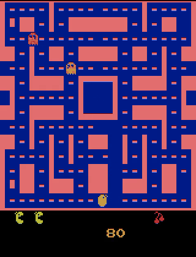

# Ms. Pac-Man DDQN

Un agente de aprendizaje por refuerzo que aprendió a jugar Ms. Pac-Man mirando los píxeles
de la pantalla. Ninguna regla del juego está programada a mano: no sabe qué es un fantasma,
qué es un pellet, ni que morir es malo. Solo recibe la imagen y el marcador.

<p align="center">
  
</p>

<p align="center">
  <a href="https://mspacman-rl.vercel.app"><b>Demo interactivo</b></a> ·
  <a href="docs/frameskip.md">El hallazgo</a> ·
  <a href="notebooks/entrenamiento.ipynb">Notebook de entrenamiento</a>
</p>

En el demo puedes ver, cuadro por cuadro, el valor que la red le asigna a cada una de las
9 acciones posibles y cuál termina ejecutando.

---

## Resultados

| Agente | Pasos de entrenamiento | Puntaje promedio |
| --- | ---: | ---: |
| Política aleatoria (línea base) | — | 202 |
| DQN estándar | 50 mil | 434 ± 92 |
| DDQN + reward shaping | 500 mil | 914 ± 138 |
| **DDQN, servido correctamente** | 500 mil | **1 755 ± 392** |

Los dos últimos renglones son **el mismo modelo**. La diferencia no fue reentrenar: fue
descubrir que se estaba sirviendo mal. Está documentado en [`docs/frameskip.md`](docs/frameskip.md)
y es la parte más interesante del proyecto.

**Lo que este agente no logró:** el DQN original de DeepMind alcanza ~2 500 puntos en
Ms. Pac-Man, y sigue estando por encima. Ese resultado usa 200 millones de pasos; este usa
500 mil, unas 400 veces menos, porque se entrenó en una sesión gratuita de Colab con
límite de tiempo y de RAM. La brecha es presupuesto de cómputo, y decirlo es más útil que
maquillar el número.

## Cómo funciona

**Entrada.** La pantalla de Atari (210×160 RGB) se convierte a escala de grises, se
reescala a 84×84 y se apilan 4 cuadros consecutivos. El apilado es lo que le da a la red
noción de movimiento: con un solo cuadro no puede saber hacia dónde va un fantasma.

**Red.** La CNN de Nature (Mnih et al., 2015) sobre `CnnPolicy` de Stable-Baselines3,
entrenada con Double DQN para reducir la sobreestimación de los valores Q.

**Reward shaping.** La recompensa cruda de Ms. Pac-Man es escasa: solo llegan puntos al
comer. Se añadieron dos señales para densificarla:

- −0.1 por paso, para que no se quede quieto en una esquina segura.
- −50 al perder una vida, que el juego por sí solo no penaliza de forma explícita.

**Evaluación.** El puntaje reportado es el del juego real, sin las penalizaciones
artificiales del shaping y sin recorte de recompensa. Medir con la función de recompensa
modificada habría inflado el número.

## Qué no funcionó

- **50 mil pasos no alcanzan.** El primer DQN llegó a 434 puntos: mejor que el azar, pero
  el agente todavía se movía casi al tanteo.
- **El buffer de repetición no cabía.** Con `buffer_size=100000` la sesión de Colab se
  quedaba sin RAM. Bajarlo a 50 mil fue la condición para poder entrenar 500 mil pasos.
- **Servir el modelo con el atajo de la librería.** El error que costó el 40 % del
  rendimiento y que sigue siendo lo que más me enseñó este proyecto.

## Correrlo

```bash
git clone https://github.com/USUARIO/mspacman-rl.git
cd mspacman-rl
pip install -r requirements.txt
```

Los pesos (27 MB) se descargan solos desde
[Releases](https://github.com/USUARIO/mspacman-rl/releases) la primera vez.

```bash
# Reproducir la comparación de pipelines de la tabla
PYTHONPATH=src python -m mspacman.evaluate --episodios 15

# Regenerar las repeticiones del demo web
PYTHONPATH=src python -m mspacman.record --episodios 12 --salida web/public/replay

# Pruebas del entorno
pytest tests -q
```

El demo web:

```bash
cd web && npm install && npm run dev
```

## Estructura

```
src/mspacman/
  envs.py       Construcción de entornos. El frameskip se declara y se verifica.
  model.py      Carga de pesos desde GitHub Releases.
  evaluate.py   Comparación reproducible de pipelines de servicio.
  record.py     Graba partidas: video 60 fps + traza de valores Q.
tests/          Pruebas de regresión del entorno.
notebooks/      El entrenamiento tal como corrió en Colab.
web/            Demo en Next.js, exportado estático para Vercel.
docs/           El hallazgo del frameskip, con la medición completa.
```

## Sobre el demo

El demo sirve **repeticiones grabadas**, no inferencia en vivo. Es deliberado: un backend
de inferencia con PyTorch en capa gratuita se duerme por inactividad, y un demo que tarda
dos minutos en despertar es peor que no tener demo. Las repeticiones son archivos estáticos
que cargan al instante y no dependen de ningún servidor.

Lo que se pierde es que el visitante no elija la partida. Lo que se gana es que el enlace
siempre funciona — y para un proyecto que se enseña, eso vale más.

## Licencia

MIT. Ver [LICENSE](LICENSE).

Ms. Pac-Man es marca registrada de Bandai Namco. Este proyecto usa el
[Arcade Learning Environment](https://github.com/Farama-Foundation/Arcade-Learning-Environment)
con fines educativos y de investigación.
